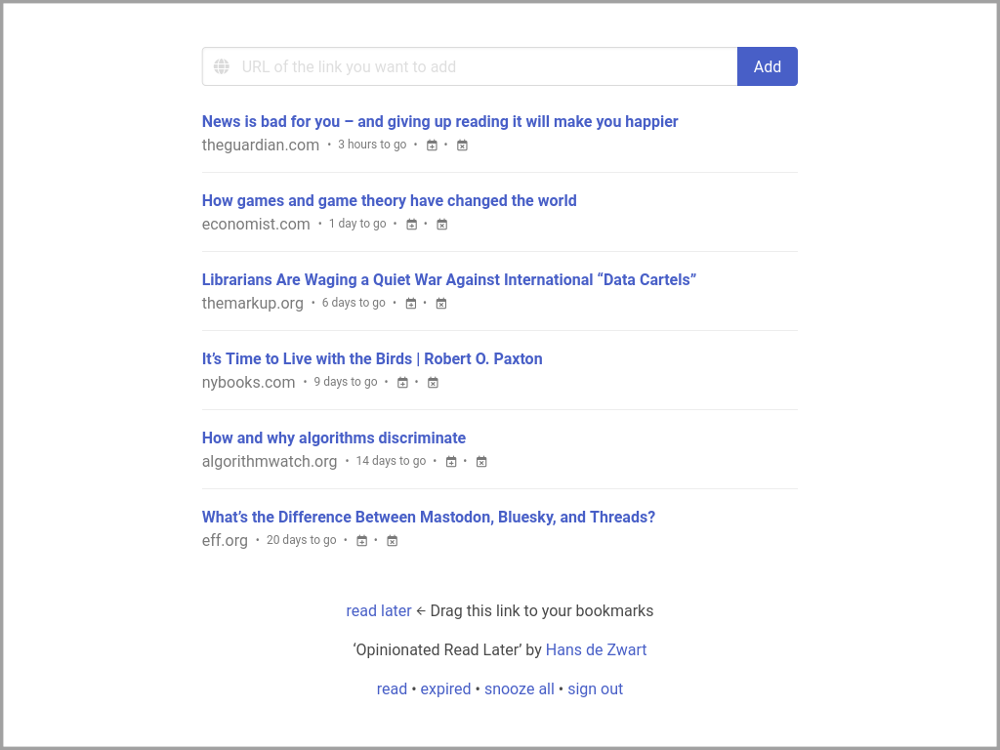

# Opinionated Read Later
A very simple Read Later tool, allowing you to save links to read later. These are then presented oldest first and will expire automatically (with an option for snoozing), keeping your list manageable.

### What makes the tool opinionated?

Do you have a bunch of open tabs in your browser with longish articles you want to read later? Then this tool should be able to help you out. There are some key ideas behind the tool on how to be intentional about your reading:

- **Treat your to-read pile like a river, not a bucket** (hat tip to [Oliver Burkeman](https://www.oliverburkeman.com/river) for this idea which inspired the tool) - You should see your to-read list like a stream of items flowing past you, not as a bucket that you should empty. That is why unread links eventually will disappear if you don't read them.
- **Reading means reading** - If you click on a link to read it, you commit yourself to actually reading it: it will disappear from your _read later_ list (and will appear on your _read_ list).
- **Read your oldest items first** - There is only one sort order: news links appear at the bottom of the page. It stimulates you to deal with the older links first (either read them or skip reading through expiring them). This idea also helps with the next point.
- **Put some time between wanting to read it, and deciding to read it** - Slow things down. You might think it is important to read something now, but you'll be a much better judge of that in a few weeks. (I copied this from the 50-day rule that I use for my personal finances: if you want something that costs more than a hundred euros, wait for 50 days and see if you then still want it).
- **Don't gamify your reading** - The tool has none of the gamification mechanisms that infest the web today. No badges, no cute texts urging you on, no graphs and counters. It won't even tell you how many links are still unread.
- **Keep it simple** - The interface is extremely simple, just showing you a list of links, including the domain they come from. Nothing else.

All of this should help you make more conscious reading choices. The fact that you are no longer _managing_ your reading, should also mean that you get more reading done.

Don't forget to play with the settings in the `.env` file. They allow for all sorts of flexible setups. For example, only seeing one (or a few) read later links at the same time, only allowing you to open the top link for reading, hiding items until they are at least a certain number of days old, or not showing the expiry times (Burkeman would approve of that one).

### How to add links
There are three ways to add links:

- Through the web interface, using a form at the top of the page. (It is easy to turn off this form if it is in the way).
- Through a bookmarklet that you can drag to your bookmarks toolbar. (This calls `/link/add` with `url` as a GET parameter, and will only work if you are logged in to the tool, use `/link/add` with [Url forwarder](https://f-droid.org/en/packages/net.daverix.urlforward/) on Android to easily add links on your phone).
- Through a REST-based API call (see below), which should allow for easy integration into other workflows.

### Taking a reading break: snoozing all links
If you don't access the tool, at some point the links you want to read will expire. You can use the _snooze all_ functionality to take a reading break. Just pick the date that you will want to start reading again, and the expiry times of all your unread and unexpired links will adjust accordingly. Perfect if you want to go offline for a while.

### There is an API
And it is simple enough not to be well documented. 😉

There are five endpoints. Each of these endpoints will only work if you add your API key to the request as a GET variable with the name `key`. Each of these endpoints returns a JSON object.

- `/api/v1/add`: expects `url` as a GET variable with the url you want to add, returns the added link.
- `/api/v1/toreadnow`: returns the one link that is at the top of the unread list.
- `/api/v1/readlaterlist`: returns all the unread links (that would also be shown on the web, depending on your configuration).
- `/api/v1/readlist`: returns all the links that have been read, most recent at the top.
- `/api/v1/expiredlist`: returns all the links that have expired, most recent at the top.

### Installation
Unfortunately, this might require a bit of knowledge on your side to get it going ([get in touch](https://blog.hansdezwart.nl/contact/) if you want a hosted version, including what you'd be willing to pay for it).

The server requires a recent version of PHP (it has been developed on 8.1.x) and should have SQLite abilities.

You can download a packaged version (which includes all the libraries) by download the zip-file titled `opiniated-read-later-version-x.x.x.zip` [here](https://github.com/hansdez/opiniated-read-later/releases/latest).

Alternatively, you can clone the Git repository [here](https://github.com/hansdez/opiniated-read-later). In that case, you have to run `composer install` to install all the dependencies.

In either case, you will have to copy the `env-template` to `.env` and at the minimum change the `PASSWORD` and `API_KEY` variables from their defaults, and set the correct `BASE_URL`.

The software assumes that the `public` directory is served by the webserver (don't serve the other directories). Also, make sure that symlinks are turned on.

### A note on security: Beware! This is a hobby project, by an amateur
The coding of this tool is done by an amateur (who has never done a unit test in his life). This means that there can be no guarantees for confidentiality, integrity, or availability. In other words: don't store any links that you can't lose or want to keep secret.

It is a single-user tool, that needs a password before you can do anything. But sessions don't expire, there is no rate limiting, and no checks against cross-site scripting. It is basically trusting PHP's URL sanitation to keep you safe.

If you find any blatant security flaws in the current code, then don't hesitate to [reach out](https://blog.hansdezwart.nl/contact/).

### It takes a village…
This software is built on top of other free software. I want to thank the people behind [PHP](https://www.php.net/), [Composer](https://getcomposer.org/), [Flight](https://docs.flightphp.com/), [Bulma](https://bulma.io/), [Font Awesome](https://fontawesome.com/), [Medoo](https://medoo.in/), and [PHP dotenv](https://github.com/vlucas/phpdotenv) for their great work, making this tiny tool possible.

### License
This is free software, licensed under an [MIT-license](LICENSE.txt).
